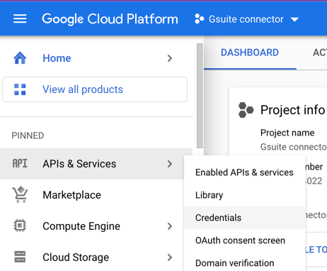

# GCP Project Users/Service Accounts List API and Google Workspace Directory API to query users POC
This POC demonstrates how to list down users and service accounts from specified project from GCP and get all users from Google Workspace directory.

# Getting Started

### If you want to run GCP API follow this
- The process is simple, just create a serviceaccount with right permission(you can assigne role/owner) to perform listing down users from projects 
- and make sure to create json key and assign to GOOGLE_APPLICATION_CREDENTIALS env variable.
- Make sure you set the envoronment variable `GOOGLE_APPLICATION_CREDENTIALS=your-service-account-key.json`
- `./gradlew bootRun` from root project. 
- it will print basic total cost for each month used. 

### If you want to run Google Workflows Directory API follow this
- Create oauth serviceaccount from gcp console to do that go to API and Services > Credentials  

- create oauth client id for "desktop app" application type  

- download the oauth token and copy it to src/main/resources/secrets.json
- then you can run the class AdminSDKDirectoryQuickstart main method 
- for the first time it will direct you to browser for user consent
- after that a `tokens` folder will be created as a datastore for your credentials.
- The consent form will only be done once.

## References
- https://cloud.google.com/iam/docs/write-policy-client-libraries
- https://developers.google.com/workspace/guides/auth-overview

# Support?
you can reach out to the git repo owner or email me at ortizmark905@gmail.com, you can also look for me from linked in and upwork.

